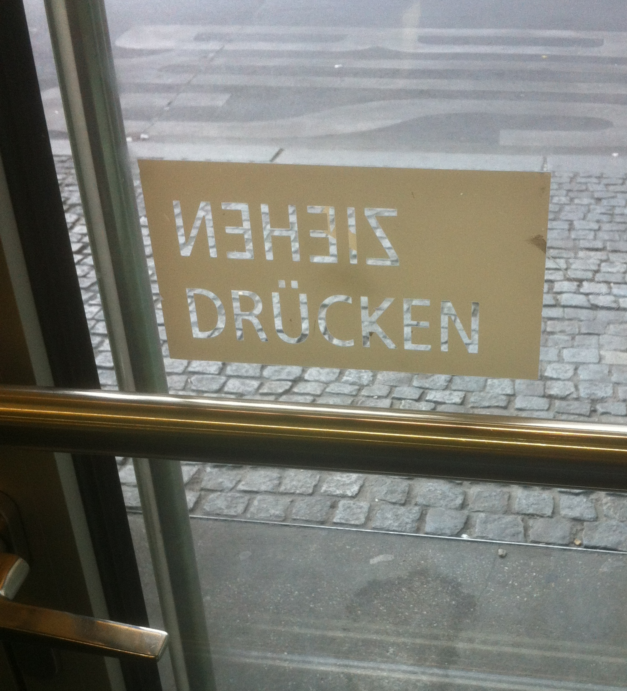

% Usability
% Florian Wilhelm
% March 22, 2005

# Motivation

## What is Usability?

Is not
- "looking good"
- ..

## What is it then?

`EN ISO 9241-110 Grundsätze der Dialoggestaltung`

- Aufgabenangemessenheit
- Selbstbeschreibungsfähigkeit
- Steuerbarkeit
- Erwartungskonformität
- Fehlertoleranz
- Individualisierbarkeit
- Lernförderlichkeit

## Not only Software

# How important is it?

## Very

We interact with systems every day.

# Who can do it?

## Designers

- 
- 

## Developers

## Psychologists

- Proper Quizes
- 

# References

http://www.vis.uni-stuttgart.de/plain/vdl/vdl_upload/264_18_8b-UI.pdf
https://www.kde.org/documentation/posting.txt
https://www.uie.com/brainsparks/2011/09/14/do-users-change-their-settings/
